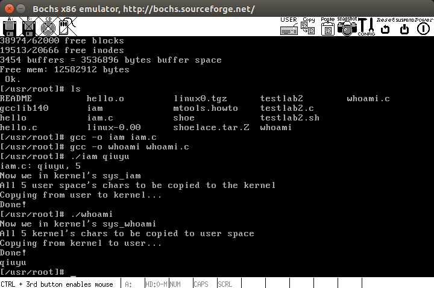
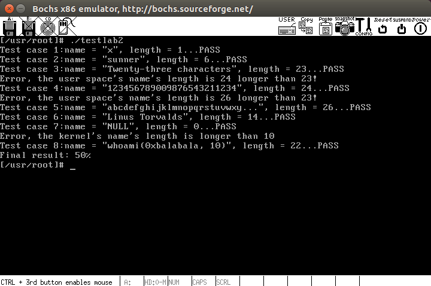
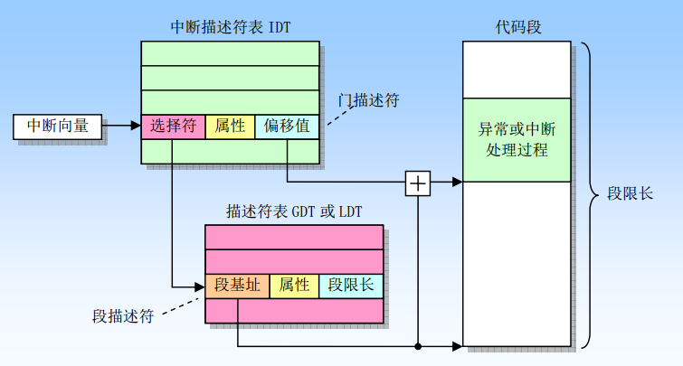

# 系统调用

## 实验内容
此次实验的基本内容是：在Linux 0.11上添加两个系统调用，并编写两个简单的应用程序测试它们。
- 系统调用    
  1. iam()    
      第一个系统调用是`iam()`，其原型为：
	```c
    int iam(const char *name);
	```
	完成的功能是将字符串参数*name*的内容拷贝到内核中保存下来。要求*name*的长度不能超过23个字符。返回值是拷贝的字符数。如果*name*的字符个数超过了23，则返回“-1”，并置*errno*为*EINVAL*。    
	在*kernel/who.c*中实现此系统调用。    
  2. whoami()    
      第二个系统调用是`whoami()`，其原型为：    
	```c
    int whoami(char *name, unsigned int size);
	```
	它将内核中由`iam()`保存的名字拷贝到*name*指向的用户地址空间中，同时确保不会对*name*越界访存(name的大小由size说明)。返回值是拷贝的字符数。如果*size*小于需要的空间，则返回“-1”，并置*errno*为*EINVAL*。    
	也是在*kernel/who.c*中实现。
- 应用程序
  1. iam.c    
      应用程序*ima.c*的`main()`函数中调用系统调用`iam()`，其接收命令行参数作为名字传递给`int iam(const char *name)`中的参数*name*。
  2. whoami.c    
      应用程序*whoami.c*的`main()`函数调用系统调用`whoami()`，将`iam()`保存在内核空间的*name*变量读出保存到函数参数*name*中，并打印输出。

  运行添加过新系统调用的Linux 0.11，在其环境下编译运行这两个测试程序*iam.c*和*whoami.c*，最终的运行结果是：
  ```c
  $ ./iam qiuyu
  $ ./whoami
  qiuyu
  ```

- 测试代码    
  1. 将*testlab2.c*在修改过的Linux 0.11上编译运行，显示结果即内核程序的得分。满分*50%*
  2. 将脚本*testlab2.sh*在修改过的Linux 0.11上运行，显示的结果即应用程序的得分。满分*30%*

- 实验报告    
  在实验报告中回答如下问题：
  从Linux 0.11现在的机制看，它的系统调用最多能传递几个参数？你能想办法来扩大这个限制吗？用文字简要描述向Linux 0.11添加一个系统调用*foo()*的步骤。    
  实验报告，*20%*

## 实验过程

### 实验结果
先放上最终的实验结果截图：
1. 应用程序测试    
应用程序*iam.c*加入了部分调试信息和内核中的*who.c*的系统调用加入了利用`printk`输出的部分调试信息。    

2. 测试程序*testlab2.c*测试结果    
只保留了内核中的*who.c*的系统调用在错误情况下的利用`printk`输出的错误提示。    

3. 测试程序*testlab2.sh*测试结果    
应用程序*iam.c*中的调试信息输出依然保留。    


### 1. 从Linux 0.11自带的库函数入手追寻系统调用的实现过程
正如实验手册所说：
> 0.11的*lib*目录下有一些已经实现的API。Linus编写它们的原因是在内核加载完毕后，会切换到用户模式下，做一些初始化工作，然后启动shell。而用户模式下的很多工作需要依赖一些系统调用才能完成，因此在内核中实现了这些系统调用的API。    

这些API部分在*lib/*目录下。我们以该目录下的*lib/open.c*为例子，研究下`open()`这个API背后的系统调用的实现过程。
1. open()    
    `open()`API的核心代码实现如下：
  ```c
  int open(const char * filename, int flag, ...)
  {
  	  register int res;
	  va_list arg;

	  va_start(arg,flag);
	  __asm__("int $0x80"
		  :"=a" (res)
		  :"0" (__NR_open),"b" (filename),"c" (flag),
		  "d" (va_arg(arg,int)));
	  if (res>=0)
		  return res;
	  errno = -res;
	  return -1;
  }
  ```
  其中关键部分便是那段嵌入汇编，其中`int $0x80`是唯一的汇编指令，其余代码均是指定输入输出以及指令执行过程中的寄存器及变量的使用。所以，`open()`API能够实现系统调用的关键就在于汇编指令`int $0x80`。    
`int $0x80`指令属于**软中断(software interrupt)**。软中断又叫做**编程异常(programmed exception)**，是异常的一种。该指令的作用是以*0x80*作为索引值，用于在**中断描述符表IDT**中查找存储了中断处理程序信息的描述符。    
  在计算机中，中断分为同步中断和异步中断两种。    
  1. 同步中断    
    同步中断也叫做异常。同步中断是当指令执行时由CPU控制单元产生，并且只有在该指令终止执行后CPU才会发出中断。
  2. 异步中断    
    异步中断也叫做中断。异步中断是由其他硬件设备随机产生的。
    异步中断又可以细分为**处理器探测异常(process-detected exception)**和**编程异常(programmed exception)**。具体细分如下：
        1. 处理器探测异常    
	处理器探测异常是当CPU执行指令时探测到的一个反常条件所产生的异常。根据CPU控制单元产生异常时保存在内核态堆栈EIP寄存器的值，可以将处理器探测异常分为3类：
	  - 故障(trap)    
		故障通常可以纠正。发生故障时保存在EIP中的值是引起故障的指令地址。因此，当异常处理程序顺利完成，即故障纠正，就会重新执行引起故障的那条指令。缺页异常就是基于这个机制。
	  - 陷阱(trap)    
	    陷阱指令执行后会立即报告给CPU。保存在内核态堆栈EIP的值是一个随后要执行的指令地址。因此，当陷阱处理程序终止时，就会接着执行下一条指令。只有当没有必要重新执行已终止的指令时，才触发陷阱。陷阱的主要用途是为了调试程序。
	  - 异常终止(abort)    
	    异常中止出现在发生了一个严重的错误。此时控制单元出了问题，不能在内核态堆栈EIP寄存器中保存引起异常的指令所在的确切位置。因此，异常中止会使受影响的进程终止。
        2. 编程异常    
	编程异常在编程者发出请求时发生。控制单元把编程异常作为陷阱来处理。因此，编程异常和陷阱类似，当编程异常处理程序终止时，紧接着执行下一条指令。

  既然`int $0x80`的作用是以*0x80*为索引值，在IDT中查找对应的描述符，我们首先要找到在IDT中设置*0x80*这个索引项的描述符的代码。在Linux 0.11的目录树下查找*0x80*这个关键字，最终在*kernel/sched.c*中的`sched_init()`函数中找到了用于设置IDT中*0x80*这个索引项的描述符的代码：
  ```c
  void sched_init(void)
  {
	  ......

	  set_intr_gate(0x20,&timer_interrupt);
	  outb(inb_p(0x21)&~0x01,0x21);
	  set_system_gate(0x80,&system_call);
  }
  ```
  其中，`set_system_gate(0x80,&system_call)`就是用于设置的代码。
2. set_system_gate()宏    
    `set_system_gate()`是一个宏，在*include/asm/system.h*中定义：
  ```c
  #define _set_gate(gate_addr,type,dpl,addr) \
  __asm__ ("movw %%dx,%%ax\n\t" \
	  "movw %0,%%dx\n\t" \
	  "movl %%eax,%1\n\t" \
	  "movl %%edx,%2" \
	  : \
	  : "i" ((short) (0x8000+(dpl<<13)+(type<<8))), \
	  "o" (*((char *) (gate_addr))), \
	  "o" (*(4+(char *) (gate_addr))), \
	  "d" ((char *) (addr)),"a" (0x00080000))

  #define set_intr_gate(n,addr) \
	  _set_gate(&idt[n],14,0,addr)

  #define set_trap_gate(n,addr) \
	  _set_gate(&idt[n],15,0,addr)

  #define set_system_gate(n,addr) \
	  _set_gate(&idt[n],15,3,addr)
  ```
  可以看出`set_system_gate()`主要借助另一个宏`_set_gate()`对IDT表中的*0x80*表项指定的描述符进行设置。
  描述符根据其**描述符类型标志S位**的不同取值可以分为两类：代码或数据段描述符(当S=1)和系统段描述符(当S=0)。
  其中系统段描述符又可以分为段描述符和门描述符两类，具体分类如下：
  ```txt
  |- 描述符
     |- 代码或数据段描述符
	 |- 系统段描述符
	    |- 段描述符
		   |- 局部描述符表(LDT)的段描述符
		   |- 任务状态段(TSS)描述符
		|- 门描述符
		   |- 调用门描述符
		   |- 中断门描述符
		   |- 陷阱门描述符
		   |- 任务门描述符
  ```
  IDT包含三种类型的描述符：中断门描述符，陷阱门描述符和任务门描述符。下面分别为这三种门描述符的字节分布：
  1. 中断门描述符

    ```register
    63                               48 47 46  44 43    40 39  37 36      32
    +----------------------------------+--+----+--+--------+-+-+-+----------+
    |                                  |P | D  |S |        |     |          | 
    |     Procedure Entry Address      |  | P  |  |  TYPE  |0 0 0| Reserved |
    |          31...16                 |  | L  |0 | 1|1|1|0|     |          |
    +-------------+--+--+--+--+--------+--+----+--+--------+-+-+-+----------+
    31                               17 16                                  0
    +----------------------------------+------------------------------------+
    |                                  |                                    |                 
    |       Segment Selector           |      Procedure Entry Address       |
    |                                  |              15...0                |
    +----------------------------------+------------------------------------+
    ```
  2. 陷阱门描述符

    ```register
    63                               48 47 46  44 43    40 39  37 36      32
    +----------------------------------+--+----+--+--------+-+-+-+----------+
    |                                  |P | D  |S |        |     |          | 
    |     Procedure Entry Address      |  | P  |  |  TYPE  |0 0 0| Reserved |
    |          31...16                 |  | L  |0 | 1|1|1|1|     |          |
    +-------------+--+--+--+--+--------+--+----+--+--------+-+-+-+----------+
    31                               17 16                                  0
    +----------------------------------+------------------------------------+
    |                                  |                                    |                 
    |       Segment Selector           |      Procedure Entry Address       |
    |                                  |              15...0                |
    +----------------------------------+------------------------------------+
    ```
  3. 任务门描述符

    ```register
    63                               48 47 46  44 43    40 39  37 36      32
    +----------------------------------+--+----+--+--------+-+-+-+----------+
    |                                  |P | D  |S |        |     |          | 
    |           Reserved               |  | P  |  |  TYPE  |0 0 0| Reserved |
    |                                  |  | L  |0 | 0|1|0|1|     |          |
    +-------------+--+--+--+--+--------+--+----+--+--------+-+-+-+----------+
    31                               17 16                                  0
    +----------------------------------+------------------------------------+
    |                                  |                                    |                 
    |      TSS Segment Selector        |               Reserved             |
    |                                  |                                    |
    +----------------------------------+------------------------------------+
    ```

  **Linux利用中断门处理中断，利用陷阱门处理异常**。因为`int $0x80`是编程异常，所以`set_system_gate()`在调用`_set_gate()`进行门描述符设置时，传入的参数是`_set_gate(&idt[n], 15, 3, addr)`，其中*15*是陷阱门中的TYPE字段的值，表明了Linux确实是用陷阱门处理异常的。    
  下面我们具体下来`set_system_gate(0x80,&system_call)`是如何设置IDT中索引值为*0x80*的这个陷阱门描述符的。
  ```c
  #define set_system_gate(n,addr) \
	  _set_gate(&idt[n],15,3,addr)
  
  #define _set_gate(gate_addr,type,dpl,addr) \
  __asm__ ("movw %%dx,%%ax\n\t" \
	  "movw %0,%%dx\n\t" \
	  "movl %%eax,%1\n\t" \
	  "movl %%edx,%2" \
	  : \
	  : "i" ((short) (0x8000+(dpl<<13)+(type<<8))), \
	  "o" (*((char *) (gate_addr))), \
	  "o" (*(4+(char *) (gate_addr))), \
	  "d" ((char *) (addr)),"a" (0x00080000))

  ```
  `set_system_gate(0x80,&system_call)`展开后调用的是`_set_gate(&idt[0x80],15,3,&system_call)`。而`_set_gate()`是包含了嵌入汇编的宏。这里的嵌入汇编代码包含了输入和输出参数，具有输入和输出参数的嵌入汇编的基本格式为：
  ```c
  __asm__("asm statements"
      :outputs
	  :inputs
	  : register-modify)
  ```
  在输入参数中，`%0`是指第一个输入参数，即`((short) (0x8000+(3<<13)+(15<<8)))`，`%1`是第二个输入参数，即`(*((char *) (&idt[0x80])))`，指的是IDT中索引为*0x80*的陷阱门描述符的8个字节的低4个字节的内容，`%2`是第三个输入参数，即`(*(4+(char *) (&idt[0x80])))`，指的是IDT中索引为*0x80*的陷阱门描述符的8个字节中的高4个字节的内容，第四个输入参数写入到了EDX寄存器，其值为`((char *) (&system_call))`，指的是中断处理过程`system_call`的入口地址，第五个参数写入到了EAX寄存器，即值*0x00080000*。    
  汇编指令部分中，执行`movw %%dx, %%ax`后，寄存器EAX的内容为：
  ```register
  31                   16 15                     0
  +----------------------+-----------------------+
  |       0x0008         |  &system_call[15:0]   |
  +----------------------+-----------------------+
  ```
  执行`movw %0, %%dx`后，寄存器EDX的内容为：
  ```register
  31                   16 15     11     7        0
  +----------------------+------+------+---------+
  |  &system_call[31:16] |1|00|0| 1111 | 00000000|
  +----------------------+-----------------------+
  ```
  执行`movl %%eax, %1`将寄存器EAX的值写入到IDT表中索引值为*0x80*的陷阱门描述符所占的8个字节的内存空间的低4个字节的内存中，执行`movl %%edx, %2`将寄存器EDX的值写入到IDT表中索引值为*0x80*的陷阱门描述符所占的8个字节的内存空间的高4个字节的内存中。此时设置好的该陷阱门描述符的内容如下：
  ```register
  63                               48 47 46  44 43    40 39  37 36      32
  +----------------------------------+--+----+--+--------+-+-+-+----------+
  |                                  |  |    |  |        |     |          | 
  |       &system_call[31:16]        |P |DPL |S |  TYPE  |0 0 0| Reserved |
  |                                  |1 | 00 |0 | 1|1|1|1|     |          |
  +-------------+--+--+--+--+--------+--+----+--+--------+-+-+-+----------+
  31                               17 16                                  0
  +----------------------------------+------------------------------------+
  |                                  |                                    |                 
  |         Segment Selector         |           &system_call[15:0]       |
  |              0x0008              |                                    |
  +----------------------------------+------------------------------------+
  ```
  而中断或异常的处理过程是：
  1. 确定与中断或异常关联的向量号*i(0 <= i <= 255)*
  2. 以该向量号*i*为索引查找由idtr寄存器指向的IDT表的对应表项的门描述符(在下面的描述中，我们假定IDT表项中包含的是一个中断门或一个陷阱门)
  3. 根据IDT表中获取的门描述符中的段选择符的值，以这个值作为索引查找由gdtr寄存器指向的GDT表的对应表项的描述符。从GDT表中获取的描述符中含有中断或异常处理程序所在段的基地址。
  4. 特权级检查    

    首先将**当前特权级CPL**(存放在CS寄存器的低两位)与从GDT中获取的段描述符中的**描述符特权级DPL**比较，如果**CPL小于DPL**，**就产生一个“General protection”异常**，因为**中断处理程序的特权不能低于引起中断的程序的特权**。对于**编程异常**，则做进一步的安全检查：比较CPL与从IDT中获取的门描述符的DPL，如果**DPL小于CPL**，**就产生一个“General protection”异常**。这个检查**可以避免用户应用程序访问特殊的陷阱门或中断门**。也就是说，**对于`int $0x80`这个编程异常，必须同时满足两个条件：DPL(in GDT) <= CPL(in CS)和CPL(in CS) <= DPL(in IDT)**。因为是用户程序调用`int $0x80`指令的，所以CS = 3，而DPL(in IDT) = 3，同时该陷阱门描述符中的段选择符的值为*0x0008*，选中的是GDT表中内核代码段的段描述符，其DPL(in GDT) = 0，满足条件DPL(in GDT) <= CPL同时CPL <= DPL(in LDT)。
  5. 检查是否发生了特权级的变化，也就是说，CPL是否不同于所选择的段描述符的DPL。如果是，控制单元必须开始使用新的特权级的栈，要发生栈切换。
  6. 在栈中保存EFLAGS，CS及EIP的内容
  7. 如果异常产生一个硬件出错码，则将它保存在栈中
  8. 装载CS和EIP寄存器的值，其值分别是IDT表中第*i*项门描述符的段选择符和偏移量字段。这些值给出了中断或异常处理程序的第一条指令的线性地址
  9. 中断或异常处理程序执行
  10. 中断或异常处理程序执行完毕后，返回到被中断程序的保存在栈中的下一条指令继续执行    
    该过程示意图如下：    
    

  因为在[实验1 操作系统的引导](https://github.com/Wangzhike/HIT-Linux-0.11/blob/master/1-boot/OS-booting.md#4-heads)中已经提到，在*setup.s*中切换到保护模式后，重新设置了GDT表，并且GDT表中最开始的3个表项与原来在*setup.s*程序中设置的GDT表除了在段限长上有些区别以外(原来*8MB*，现为*16MB*)，其他内容完全一样。不同的是，*setup.s*中设置的GDT表是临时的，只设置了3个表项，而*head.s*中设置的GDT表在后面一直使用，这里除了设置最开始的3个表项(空描述符，内核代码段描述符，内核数据段描述符)外，还把其他表项全部清零。而*0x80*索引从IDT表中选中的陷阱门描述符中的段选择符为*0x0008*，这个段选择符选中的是GDT表中的内核代码段描述符，其字节分布如下：
  ```register
   63          54 53 52 51 50       48 47 46  44  43    40 39             32
   +-------------+--+--+--+--+--------+--+----+--+--------+----------------+
   | BaseAddress |G |B |0 |A |Seg Lim |P |DPL |S |  TYPE  | BaseAddress    | 
   |   31...24   |  |  |  |V |19...16 |  |    |  | 1|C|R|A|   23...16      |
   |     0x00    |1 |1 |  |L |  0x00  |1 |00  |1 | 1|0|1|0|     0x00       |
   +-------------+--+--+--+--+--------+--+----+--+--------+----------------+
   31                               17 16                                  0
   +----------------------------------+------------------------------------+
   |            BaseAddress           |            Segment Limit           |                 
   |             15...0               |                 15...0             |
   |              0x00                |                 0x0fff             |
   +----------------------------------+------------------------------------+
  ```
  可以看到内核代码段的基地址是*0x00000000*，这也是显而易见的，因为在*setup.s*中，设置好了临时的GDT表(该临时GDT表与现在的GDT表相比，只有最开始的3个表项，而且段限长为*8MB*，而不是*16MB*，其余与现在GDT表最开始的3个表项的内容均一样)，切换到32位保护模式，正是使用`jmpi 0, 8`这条指令跳转到物理内存地址*0x00000000*处执行的，而*8*是CS寄存器的值，选中的正是临时GDT表中的内核代码段，所以现在的GDT表的内核代码段的基地址也肯定为*0x00000000*。
  这样，`int $0x80`指令对应的系统调用处理程序的基地址是*0x00000000*，偏移地址为*&system_call*，所以系统调用对应的中断处理程序就是`system_call`。

3. system_call    
    `system_call`函数在*kernel/system_call.s*中：    
  ```c
  system_call:
	  cmpl $nr_system_calls-1,%eax
	  ja bad_sys_call
	  push %ds
	  push %es
	  push %fs
	  pushl %edx
	  pushl %ecx		# push %ebx,%ecx,%edx as parameters
	  pushl %ebx		# to the system call
	  movl $0x10,%edx		# set up ds,es to kernel space
	  mov %dx,%ds
	  mov %dx,%es
	  movl $0x17,%edx		# fs points to local data space
	  mov %dx,%fs
	  call sys_call_table(,%eax,4)
	  pushl %eax
	  movl current,%eax
	  cmpl $0,state(%eax)		# state
	  jne reschedule
	  cmpl $0,counter(%eax)		# counter
	  je reschedule
  ret_from_sys_call:
	  movl current,%eax		# task[0] cannot have signals
	  cmpl task,%eax
	  je 3f
  ```
  堆栈切换的工作是由处理器完成的，所以一旦进入到系统调用的处理函数`system_call`时，已经处于内核栈中了。可以看到`system_call`函数首先将DS，ES，FS这些数据段寄存器压栈，然后将保存在EBX，ECX，EDX的库函数API的参数逆序压栈。对于这些函数参数可以再次看下*lib/open.c*中`open()`API的实现：
  ```c
  int open(const char * filename, int flag, ...)
  {
  	  register int res;
	  va_list arg;

	  va_start(arg,flag);
	  __asm__("int $0x80"
		  :"=a" (res)
		  :"0" (__NR_open),"b" (filename),"c" (flag),
		  "d" (va_arg(arg,int)));
	  if (res>=0)
		  return res;
	  errno = -res;
	  return -1;
  }
  ```
  可以看到，`%0`是EAX寄存器，其值为`__NR_open`，即系统调用号，EBX寄存器保存的是文件名参数，ECX寄存器保存的是标志位参数，EDX寄存器保存的是可变参数的基地址。从中可以看出**Linux 0.11的机制，它的系统调用最多可以传递3个参数。如果想要传递更多的参数，可以参见下面：3. 基于`open()`函数看函数的可变参数是如何实现的**。    
  注意到`system_call`将DS和ES寄存器设置为*0x10*，其正好是内核数据段在GDT表中的索引值。将FS寄存器设置为*0x17*，其字节分布如下：
  ```register
  15                            2  1  0
  +----------------------------+--+--+--+
  |         Descriptor Index   |TI| RPL |
  |              1             |1 | 11  |
  +----------------------------+--+--+--+
  ```
  其TI=1，说明该段选择符选择的是局部描述符表LDT中的段描述符，RPL=3说明是用户态的特权级，索引值为*0x10*说明是数据段，所以*0x17*是LDT中的用户数据段的选择符，所以设置FS=0x17，便是让FS指向用户数据段。因为**FS寄存器指向用户数据段，所以FS寄存器是内核空间和用户空间进行数据传递的桥梁**。    
  而真正实现指定系统调用功能的是`call sys_call_table(,%eax,4)`指令。
  `sys_call_table`是一个指针数组，其元素类型为函数指针，在*include/linux/sys.h*中定义：
  ```c
  extern int sys_setup();
  extern int sys_exit();
  extern int sys_fork();
  extern int sys_read();
  extern int sys_write();
  extern int sys_open();
  extern int sys_close();
  ......
  extern int sys_setsid();
  extern int sys_sigaction();
  extern int sys_sgetmask();
  extern int sys_ssetmask();
  extern int sys_setreuid();
  extern int sys_setregid();

  fn_ptr sys_call_table[] = { sys_setup, sys_exit, sys_fork, sys_read,
  sys_write, sys_open, sys_close, sys_waitpid, sys_creat, sys_link,
  sys_unlink, sys_execve, sys_chdir, sys_time, sys_mknod, sys_chmod,
  sys_chown, sys_break, sys_stat, sys_lseek, sys_getpid, sys_mount,
  sys_umount, sys_setuid, sys_getuid, sys_stime, sys_ptrace, sys_alarm,
  sys_fstat, sys_pause, sys_utime, sys_stty, sys_gtty, sys_access,
  sys_nice, sys_ftime, sys_sync, sys_kill, sys_rename, sys_mkdir,
  sys_rmdir, sys_dup, sys_pipe, sys_times, sys_prof, sys_brk, sys_setgid,
  sys_getgid, sys_signal, sys_geteuid, sys_getegid, sys_acct, sys_phys,
  sys_lock, sys_ioctl, sys_fcntl, sys_mpx, sys_setpgid, sys_ulimit,
  sys_uname, sys_umask, sys_chroot, sys_ustat, sys_dup2, sys_getppid,
  sys_getpgrp, sys_setsid, sys_sigaction, sys_sgetmask, sys_ssetmask,
  sys_setreuid,sys_setregid };
  ```
  其中`fn_ptr`的类型在*inlude/linux/sched.h*中定义：
  ```c
  typedef int (*fn_ptr)();
  ```
  可见`fn_ptr`的类型为`int (*)()`，是一个指向参数为*void*，返回值为*int*的函数的指针。而`sys_call_table`数组里面存放的便是Linux 0.11所有可用的系统调用的内核实现函数的入口地址。所以我们要添加自己的系统调用，必须在该数组中加入我们自己系统调用的内核实现函数的入口地址，可以参考已有的系统调用的内核实现函数，使用我们自己的实现函数也使用`sys_`前缀开头，并且要在该头文件中声明实现函数。
  `call sys_call_table(,%eax,4)`使用的是间接内存引用，在AT&T语法下的格式为：`section:disp(base, index, scale)`，其中`base`和`index`是可选的32位基地址寄存器和索引寄存器，`disp`是可选的偏移值，`scale`是比例因子，取值范围是1,2,4和8。`scale`乘上索引`index`用来计算操作数的地址。如果没有指定`scale`，则`scale`取默认值1。所以`call`指令的跳转地址是`sys_call_table + 4 * %eax`，因为函数指针的长度是4字节，所以跳转地址也就是`sys_call_table[%eax]`。而EAX寄存器存放的是调用指定的系统调用的系统调用号。
  `open()`API的系统调用号为`__NR_open`，在*include/unistd.h*中定义：
  ```c
  #ifdef __LIBRARY__

  #define __NR_setup	0	/* used only by init, to get system going */
  #define __NR_exit	1
  #define __NR_fork	2
  #define __NR_read	3
  #define __NR_write	4
  #define __NR_open	5
  #define __NR_close	6
  ......
  #define __NR_setsid	66
  #define __NR_sigaction	67
  #define __NR_sgetmask	68
  #define __NR_ssetmask	69
  #define __NR_setreuid	70
  #define __NR_setregid	71

  #define _syscall0(type,name) \
  type name(void) \
  { \
  long __res; \
  __asm__ volatile ("int $0x80" \
	  : "=a" (__res) \
	  : "0" (__NR_##name)); \
  if (__res >= 0) \
	  return (type) __res; \
  errno = -__res; \
  return -1; \
  }

  #define _syscall1(type,name,atype,a) \
  type name(atype a) \
  { \
  long __res; \
  __asm__ volatile ("int $0x80" \
	  : "=a" (__res) \
	  : "0" (__NR_##name),"b" ((long)(a))); \
  if (__res >= 0) \
	  return (type) __res; \
  errno = -__res; \
  return -1; \
  }

  #define _syscall2(type,name,atype,a,btype,b) \
  type name(atype a,btype b) \
  { \
  long __res; \
  __asm__ volatile ("int $0x80" \
	  : "=a" (__res) \
	  : "0" (__NR_##name),"b" ((long)(a)),"c" ((long)(b))); \
  if (__res >= 0) \
	  return (type) __res; \
  errno = -__res; \
  return -1; \
  }

  #define _syscall3(type,name,atype,a,btype,b,ctype,c) \
  type name(atype a,btype b,ctype c) \
  { \
  long __res; \
  __asm__ volatile ("int $0x80" \
	  : "=a" (__res) \
	  : "0" (__NR_##name),"b" ((long)(a)),"c" ((long)(b)),"d" ((long)(c))); \
  if (__res>=0) \
	  return (type) __res; \
  errno=-__res; \
  return -1; \
  }

  #endif /* __LIBRARY__ */
  ```
  可见要实现我们自己的系统调用的内核实现函数，也必须在该头文件中定义自己系统调用的系统调用号。    
  同时注意到该头文件还定义了`_syscall0`，`_syscall1`，`_syscall2`，`_syscall3`这四个宏函数，其定义中是包含了`int $0x80`指令的嵌入汇编代码。定义这4个宏函数的目的是方便系统调用的API函数调用内核中对应的该系统调用的实现函数，比如`sys_open()`函数等。所以我们自己定义的系统调用的测试程序中，可以适当调用这4个宏函数，去调用内核中系统调用的实现函数。    
  至此，我们总结下系统调用的基本过程：    
  1. 应用程序调用库函数(API)    
  2. API函数要么通过自己添加含有`int $0x80`的嵌入汇编代码，要么调用`syscall0`到`syscall3`这4个宏函数，将系统调用号存入EAX寄存器，通过`int $0x80`编程异常处理进入到内核态的系统调用处理函数`system_call`
  3. 系统调用处理函数`system_call`根据系统调用号，调用对应的内核函数(真正的系统调用实现函数)
  4. `system_call`处理完成返回到API函数中，并将内核函数的返回值通过EAX寄存器传递给API函数
  5. API函数将该返回值返回给应用程序    

  而在Linux 0.11添加一个系统调用`foo()`的步骤：    
  1. 编写API函数`foo()`，根据其参数个数调用`syscall0`到`syscall3`这4个宏函数的其中一个，或者手动添加含有`int $0x80`的嵌入汇编代码，通过EAX寄存器传入系统调用号，进入内核
  2. 在内核中实现真正的系统调用函数`sys_foo()`，并修改对应的makefile文件
  3. 同时在`sys_call_table`中加入`sys_foo()`函数的函数名，即入口地址，在该头文件中声明`sys_foo()`函数
  4. 在*include/unistd.h*中定义`sys_foo()`函数的系统调用号
  5. 别忘了修改*kernel/system_call.s*中代表系统调用总数的变量`nr_system_calls`的值
  6. 编写测试程序，修改添加了`foo()`系统调用的Linux 0.11的文件系统下的*unistd.h*文件，加入`foo()`的系统调用号，运行测试程序，检验效果

### 2. 在用户态和核心态之间传递数据

我们已经知道在执行系统调用处理函数时，FS寄存器指向用户数据段，是内核空间和用户空间进行数据传递的桥梁。但是如何利用FS寄存器进行用户态和内核态的数据传递呢？    
要实现的两个系统调用参数中都有字符串指针，这些字符串指针都是用户态的数据，在实现系统调用时，我们处于内核态，不能直接访问这些字符串指针。`open(char *filename, ...)`函数中也含有字符串指针参数，所以查看`open()`系统调用的处理。
`open()`API在*/lib/open.c*定义：    
```c
int open(const char * filename, int flag, ...)
{
	register int res;
	va_list arg;

	va_start(arg,flag);
	__asm__("int $0x80"
		:"=a" (res)
		:"0" (__NR_open),"b" (filename),"c" (flag),
		"d" (va_arg(arg,int)));
	if (res>=0)
		return res;
	errno = -res;
	return -1;
}
```

系统调用通过`eax`，`ebx`，`ecx`，`edx`传递参数。其中`eax`传递系统调用号，文件名指针由`ebx`传递。进入内核后，通过`ebx`取出文件名字符串。而open的`ebx`指向的文件名在用户空间，在内核空间不能直接访问该文件名字符串，继续看`open`系统调用的处理。    
下面转到`sys_open`执行。    
`sys_open`在*/fs/open.c*中定义：    
```c
int sys_open(const char * filename,int flag,int mode)
{
	......
	if ((i=open_namei(filename,flag,mode,&inode))<0) {
		current->filp[fd]=NULL;
		f->f_count=0;
		return i;
	}
	......
}
```

`sys_open`将文件名参数传给了`open_namei()`。    
`open_namei()`在*/fs/namei.c*中定义：    
```c
int open_namei(const char * pathname, int flag, int mode,
	struct m_inode ** res_inode)
{
	...
	if (!(dir = dir_namei(pathname,&namelen,&basename)))
		return -ENOENT;
	...
}
```

`open_namei`将文件名传给`dir_namei()`。    
`dir_namei()`在*/fs/namei.c*中定义：    
```c
static struct m_inode * dir_namei(const char * pathname,
	int * namelen, const char ** name)
{
	...
	if (!(dir = get_dir(pathname)))
		return NULL;
	basename = pathname;
	while ((c=get_fs_byte(pathname++)))
		if (c=='/')
			basename=pathname;
	*namelen = pathname-basename-1;
	*name = basename;
	return dir;
}
```

`dir_namei`将文件名又传给了`get_dir()`。    
`dir_namei`在*/fs/namei.c*中定义：    
```c
static struct m_inode * get_dir(const char * pathname)
{
	...
	if ((c=get_fs_byte(pathname))=='/') {
		inode = current->root;
		pathname++;
	} 
  	...
}
```

可以看到用`get_fs_byte()`获得一个字节的用户空间中的数据。    
`get_fs_byte()`在*/include/asm/segment.h*中实现：    
```c
static inline unsigned char get_fs_byte(const char * addr)
{
	unsigned register char _v;

	__asm__ ("movb %%fs:%1,%0":"=r" (_v):"m" (*addr));
	return _v;
}
```

其中：    
```assembly
%0 = "=r" (_v)		//输出变量，get_fs_byte()的返回值
%1 = "m" (*addr))	//内存变量，用户地址空间的偏移地址
movb %%fs:%1,%0		//把由fs:addr指向的内存地址的一个字节的数据复制到get_fs_byte()的返回值
```

而使用`put_fs_byte()`可以实现从核心态拷贝一个字节的数据到用户态。`put_fs_byte()`也在*/include/asm/segment.h*实现：    
```c
static inline void put_fs_byte(char val,char *addr)
{
__asm__ ("movb %0,%%fs:%1"::"r" (val),"m" (*addr));
}
```

`put_fs_byte()`和`get_fs_byte()`正好相反，把内核态一个字节的数据`var`拷贝到由`fs:addr`指向的用户态内存地址空间。    
**put_fs_xxx()**：核心态—>用户态    
**get_fs_xxx()**：用户态—>核心态    

### 3. 基于open()函数看函数的可变参数是如何实现的
先看*lib/open.c*中的`open()`API的定义：
```c
#define __LIBRARY__
#include <unistd.h>
#include <stdarg.h>

int open(const char * filename, int flag, ...)
{
	register int res;
	va_list arg;

	va_start(arg,flag);
	__asm__("int $0x80"
		:"=a" (res)
		:"0" (__NR_open),"b" (filename),"c" (flag),
		"d" (va_arg(arg,int)));
	if (res>=0)
		return res;
	errno = -res;
	return -1;
}
```
`open()`函数的参数列表中的最后的`...`表示这是一个可变参数，它表明此处可能传递数量和类型未确定的参数。而`open()`函数体中出现的`va_list`类型和`va_arg()`宏都是在*include/stdarg.h*中定义的：
```c
#ifndef _STDARG_H
#define _STDARG_H

typedef char *va_list;

/* Amount of space required in an argument list for an arg of type TYPE.
   TYPE may alternatively be an expression whose type is used.  */

#define __va_rounded_size(TYPE)  \
  (((sizeof (TYPE) + sizeof (int) - 1) / sizeof (int)) * sizeof (int))

#ifndef __sparc__
#define va_start(AP, LASTARG) 						\
 (AP = ((char *) &(LASTARG) + __va_rounded_size (LASTARG)))
#else
#define va_start(AP, LASTARG) 						\
 (__builtin_saveregs (),						\
  AP = ((char *) &(LASTARG) + __va_rounded_size (LASTARG)))
#endif

void va_end (va_list);		/* Defined in gnulib */
#define va_end(AP)

#define va_arg(AP, TYPE)						\
 (AP += __va_rounded_size (TYPE),					\
  *((TYPE *) (AP - __va_rounded_size (TYPE))))

#endif /* _STDARG_H */
```
可以看出，`va_list`的类型是`char *`，`va_start()`宏的作用是获取传给函数的可变参数列表的第一个参数的地址，其是调用`__va_rounded_size()`宏实现的。该宏用于获取取整后的参数*TYPE*类型的字节长度值。由于`va_start(AP, LASTARG)`中的参数*LASTARG*是函数参数中的省略号前最后一个有名字的参数，所以其地址加上该参数的字节长度，便是可变参数列表的第一个参数的地址。`va_arg()`宏会根据参数类型*TYPE*对可变参数的地址*AP*进行一次偏移，使其指向下一个参数的首地址，并返回当前参数的值。这样每调用一次`va_arg()`宏，就会将可变参数列表中指定了类型的当前参数的值取出，并使*AP*指向列表中下一个参数的首地址。而`va_end()`宏在可变参数列表中的所有参数被读取完毕后调用。    
所以，可变参数列表通过声明一个类型为`va_list`的变量，配合使用`va_start`，`va_arg`和`va_end`这3个宏来实现。具体在一个用户应用程序中使用可变参数列表的步骤为：
1. 函数参数列表至少有一个命名参数，命名参数的最后是一个表示可变参数的省略号`...`
2. 函数体中声明一个`va_list`类型的变量，用于访问可变参数列表
3. `va_list`类型的变量通过调用`va_start()`来初始化，将该变量设置为指向可变参数列表的第1个参数
4. 调用`va_arg()`访问参数。`va_arg()`宏接受两个参数：`va_list`类型的变量和要获取的可变参数列表中下一个参数的类型
5. 访问完毕最后一个可变参数后，调用`va_end`

利用可变参数机制，我们可以在Linux 0.11下打破系统调用最多只能传递3个参数的限制。具体的用法可以参照常见的`printf()`函数的实现。

### 4. 其他说明

#### 4.1 GCC内联汇编
1. 如果要同时执行多条汇编语句，则应该用"\n\t"将各个语句分隔开，例如：
 ```c
   __asm__( "movw %%dx, %%ax\n\t"
   		"movw %0, %%dx\n\t"
           "movl %%edx, %2")
 ```

2. 通常嵌入到C代码中的汇编语句很难做到与其他部分没有任何关系，因此更多时候需要用到完整的内联汇编格式：
 ```c
   __asm__("asm statements" : outputs : inputs : register-modified)
 ```
 插入到C代码中的汇编语句是以`:`分隔的四个部分，第一部分是汇编代码本身，通常成为指令部。指令部是必须的，而其它部分可以根据实际情况而省略。		
 GCC采用如下方法来解决**汇编代码中操作数如何与C代码中的变量相结合**的问题：对寄存器的使用只需给出**“样板”**和**约束条件**，具体如何将寄存器与变量结合起来完全由GCC和GAS负责。具体而言就是：在指令部，加上前缀`%`的数字(如%0,%1)就是需要使用寄存器的**“样板”**操作数。指令部中使用几个样板操作数，就表明有几个变量需要与寄存器相结合，这样GCC和GAS在编译和汇编时会根据后面给定的**约束条件**进行恰当的处理。由于样板操作数也使用`%`作为前缀，因此寄存器名前面应该加上两个`%`，以免产生混淆。		
 紧跟在指令部后面的是输出部，是规定输出变量如何与样板操作数进行结合的条件，每个条件称为一个“约束”，必要时可以包含多个约束，相互之间用逗号分隔开就可以。每个输出约束都以'='号开始，然后紧跟一个对操作数类型进行说明的字后，最后是如何与变量相结合的约束。凡是与输出部中说明的操作数相结合的寄存器或操作数本身，在执行完嵌入的汇编代码后均不保留执行之前的内容，这是GCC在调度寄存器时所使用的依据。		
 输出部后面是输入部，输入约束与输出约束相似，但不带'='号。如果一个输入约束要求使用寄存器，则GCC在预处理时就会为之分配一个寄存器，并插入必要的指令将操作数装入该寄存器。与输入部中说明的操作数结合的寄存器或操作数本身，在执行完嵌入的汇编代码后也不保留执行之前的内容。		
 在内联汇编中用到的操作数从输出部的第一个约束开始编号，序号从0开始，每个约束计数一次。需要注意的是，内联汇编语句的指令部在引用一个操作数时总是将其作为32位的长字使用，但实际情况可能需要的是字或者字节，因此应该在约束中指明正确的限定符：		

| 限定符                | 意义                       |
| ------------------ | ------------------------ |
| "m", "v", "o"      | 内存单元                     |
| "r"                | 任何寄存器                    |
| "q"                | 寄存器eax, ebx, ecx, edx之一  |
| "i", "h"           | 直接操作数                    |
| "E"和"F"            | 浮点数                      |
| "g"                | 任意                       |
| "a", "b", "c", "d" | 分别表示寄存器eax, ebx, ecx和edx |
| "S"和"D"            | 寄存器esi, edi              |
| "i"                | 常数(0至31)                 |

#### 4.2 仔细分析int $0x80最终展开代码
```c
__asm__("movw %%dx, %%ax\n\t"
	"movw %0, %%dx\n\t"
    "movl %%eax, %1\n\t"
    "movl %%edx, %2"
    :
    : "i" ((short) (0x8000+(3<<13)+(15<<8))),
    "o" (*((char *) (&idt[0x80]))),
    "o" (*(4+(char *) (&idt[0x80]))),
    "d" ((char *) (&system_call)), "a" (0x00080000))
```

输入部涉及的寄存器有`eax`和`edx`，其初始值如下：

```register
   31                   16 15                     0
   +----------------------+-----------------------+
eax|       0x0008         |        0x0000         |
   +----------------------+-----------------------+

   31                   16 15                     0
   +----------------------+-----------------------+
edx|             &system_call                     |
   +----------------------+-----------------------+   
```

操作数从输出部开始计数，此处输出部为空，所以

```c
%0 = "i" ((short) (0x8000+(3<<13)+(15<<8)))		//立即数
%1 = "o" (*((char *) (&idt[0x80])))			//内存地址
%2 = "o" (*(4+(char *) (&idt[0x80])))		//内存地址
```

其中`%1`和`%2`是`idt`表中`0x80`项对应的8字节描述符中第0个和第4个字节的内存地址。

1. 执行`movw %%dx, %%ax`后，`movw`为字操作运算，eax寄存器的值如下：

```register
 31                   16 15                     0
   +--------------------------+---------------------------+
eax|       0x0008             |&system_call && 0x0000ffff |
   +--------------------------+---------------------------+
```

2. 执行`movw %0, %%dx`后，edx寄存器的值如下：

```register
   31                   16 15                     0
   +---------------------------+----------------------------+
edx|&system_call && 0xffff0000 |    0x8000+(3<<13)+(15<<8)  |
   +---------------------------+----------------------------+ 
```

3. 执行`movl %%eax, %1`和`movl %%edx, %2`后，`movl`为32bit操作指令，`idt`表中`0x80`项对应的描述符的内容如下：

```register
   63                          48 47                            32
   +-----------------------------+--------------------------- ---+
   | &system_call && 0xffff0000  |     0x8000+(3<<13)+(15<<8)    |
   +-----------------------------+-------------------------------+
   31                          16 15                             0
   +-----------------------------+-------------------------------+
   |            0x0008           |  &system_call && 0x0000ffff   |
   +-----------------------------+-------------------------------+   
```

而中断描述符的格式如下：

```register
   63                               48 47 46   44                          32
   +----------------------------------+--+----+--------------------- -------+
   |  interrupt handler entry offset  |P |DPL |                             |
   |             31...16              |  |    |                             |
   +----------------------------------+-------------------------------------+
   31                               16 15                                   0
   +----------------------------------+-------------------------------------+
   |           段选择符                |  interrupt handler entry offset     |
   |                                  |             15...0                  |
   +----------------------------------+-------------------------------------+   
```

#### 4.3 内核态iam()和whoami()的实现

内核态`iam()`和`whoami()`就是对应的系统调用`sys_iam()`和`sys_whoami()`的真正实现。

这里注意实验要求：

> int iam(const char* name);
>
> 完成的功能是将字符串参数name的内容拷贝到内核中保存下来。要求name的长度不能超过23个字符。返回值是拷贝的字符数。如果name的字符个数超过了23，则返回“-1”，并置errno为EINVAL。

也就是说，首先要判断`name`的字符个数是否超过23，**如果没有超过23，才将name字符串保存到内核空间。**

同样，`whoami()`的要求

> int whoami(char* name, unsigned int size);
>
> 它将内核中由iam()保存的名字拷贝到name指向的用户地址空间中，同时确保不会对name越界访存（name的大小由size说明）。返回值是拷贝的字符数。如果size小于需要的空间，则返回“-1”，并置errno为EINVAL。

也就是说，首先判断**name的长度是否超过size**，**如果name的值小于size，才将name字符串返回到用户空间，并且打印显示。**

