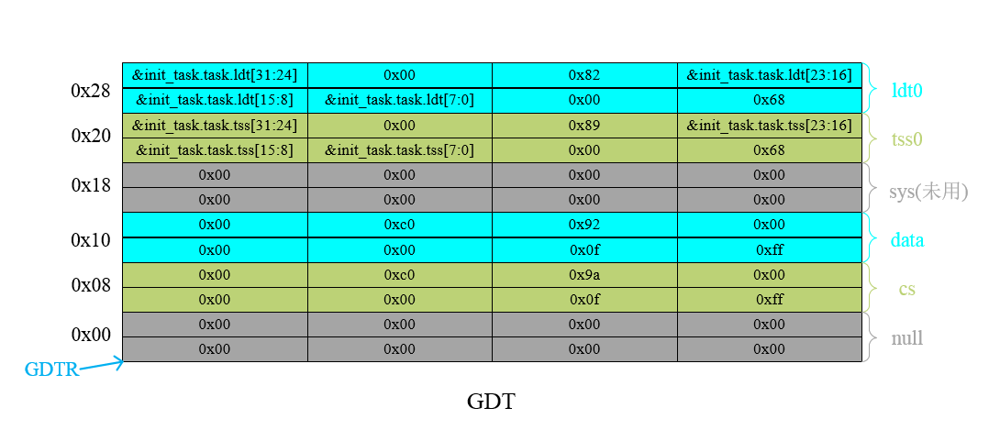

# 进程运行轨迹的跟踪与统计

## 实验内容
进程从创建(Linux下调用*fork()*)到结束的整个过程就是进程的生命期，进程在其生命期中的运行轨迹实际上表现为进程状态的多次切换，如进程创建以后会成为就绪态；当该进程被调度以后会切换到运行态；在运行的过程中如果启动一个文件读写操作，操作系统会将该进程切换到阻塞态(等待态)从而让出CPU；当文件读写完毕，操作系统会将其切换成就绪态，等待进程调度算法来调度该进程执行……
本实验内容包括：
- 基于模板*process.c*编写多进程的样本程序，实现如下功能：
  - 所有子进程都并行执行，每个子进程的实际运行时间一般不超过30秒
  - 父进程向标准输出打印所有子进程的id，并在所有子进程都退出后才退出
- 在Linux 0.11上实现进程运行轨迹的跟踪    
  基本任务是在内核中维护一个日志文件*/var/process.log*，把操作系统启动到系统关机过程中所有进程的运行轨迹都记录在这一log文件中    
  */var/process.log*文件的格式必须为：
  ```log
  pid	X	time
  ```
  其中：
  - pid是进程的ID
  - X可以是N，J，R，W和E中的任意一个
    - N 进程新建
	- J 进入就绪态
	- R 进入运行态
	- W 进入阻塞态
	- E 退出
  - time表示X发生的时间。这个时间不是物理时间，而是系统的滴答时间(tick)    
  三个字段之间用制表符分隔    
  例如：
  ```log
  12    N    1056
  12    J    1057
  4    W    1057
  12    R    1057
  13    N    1058
  13    J    1059
  14    N    1059
  14    J    1060
  15    N    1060
  15    J    1061
  12    W    1061
  15    R    1061
  15    J    1076
  14    R    1076
  14    E    1076
  ......
  ```
- 在修改过的0.11上运行样本程序，通过分析log文件，统计该程序建立的所有进程的等待时间，完成时间(周转时间)和运行时间，然后计算平均等待时间，平均完成时间和吞吐量。可以自己编写统计程序，也可以使用python脚本程序——*stat_log.py*(在[实验楼实验环境：操作系统原理与实践](https://www.shiyanlou.com/courses/115)的在线Linux实验环境*/home/teacher*目录下)——进行统计
- 修改0.11进程调度的时间片，然后再运行同样的样本程序，统计同样的时间数据，和原有的情况对比，体会不同时间片带来的差异
- 实验报告
  完成实验后，在实验报告中回答如下问题：
  - 结合自己的体会，谈谈从程序设计者的角度，单进程编程和多进程编程最大的区别是什么？
  - 你是如何修改时间片的？仅针对样本程序建立的进程，在修改时间片前后，log文件的统计结果(不包括Graphic)都是什么样？结合你的修改分析一下为什么会这样变化，或者为什么没变化？
- 评分标准
  - process.c，50%
  - 日志文件成功建立，5%
  - 能向日志文件输出信息，5%
  - 5种状态都能输出，10%(每种2%)
  - 调度算法修改，10%
  - 实验报告，20%

## 实验分析

### 1. main函数
*init/main.c*中的*main*函数是*boot/head.s*执行完后接着执行的代码。
*main*函数首先统计物理内存的容量，并对物理内存进行功能划分。然后进行所有方面的硬件初始化工作，包括陷阱门，块设备，字符设备和tty。人工设置任务0(进程0)的PCB以及其在GDT表中的任务状态段描述符tss0和局部描述符表描述符ldt0，然后通过模拟从特权级变化的内核中断处理过程的返回机制，手动切换到任务0中。在任务0中通过`fork()`系统调用创建出子进程任务1(进程1：init进程)，由init进程进行进一步的处理工作。而任务0不会退出，它会在系统没有进程运行的空闲状态被调度执行，而任务0也只是调用`puase()`系统调用主动休眠，再次引发系统调度，以检查当前是否有其他进程需要调度。

#### 1.1 物理内存的功能划分
`memory_end`变量记录了以字节为单位的物理内存的容量，并且是页大小(*4KB*)的整数倍。`buffer_memory_end`记录了高速缓冲区的尾端地址，其中包括了用于显存和设备以及ROM BIOS的物理内存。`main_memory_start`记录了主内存区的起始地址，一般来说，`main_memory_start`等于`buffer_memory_end`。如果系统包含虚拟盘，则`main_memory_start`的起始地址相对于`buffer_memory_end`的地址要后移，从而为虚拟盘留出内存空间。
由此可知，系统的物理内存被划分为内核模块，高速缓冲区，虚拟盘，主内存区四大部分。以拥有*16MB*的物理内存的系统为例，下图展示了其物理内存的功能划分：    


##### 1.1.1 mem_map数组
`mem_map`数组是全局的，用于对系统扩展内存(大于*1MB*的物理内存)的使用情况以页为单位进行统计。在系统在进行内存初始化时就将*1MB~4MB*的高速缓冲区以及虚拟盘(如果存在)设置为已用状态，所以内存管理模块是对主内存区进行分配管理的。

#### 1.2　任务0的内存布局
进程控制块PCB是一个`task_struct`类型的结构体，里面存放了系统用于描述进程的所有信息：进程的pid，进程的状态，进程的已经打开的文件描述符等，其中有两个特别重要的数据结构：用于存放**硬件上下文(hardware context)**的**任务状态段(Task State Segment, TSS)**和存放进程数据段和代码段信息的**局部描述符表(Local Descriptor Table, LDT)**。    
**硬件上下文**是进程开始执行(被创建后第一次执行)或恢复执行(退出CPU使用权后再次被调度执行)前必须装入CPU寄存器的一组数据。其中包含了和进程代码段有关的寄存器cs和eip，和进程数据段有关的寄存器ds,es,fs,gs,esi,edi，和进程用户态堆栈有关的寄存器ss和esp以及内核态堆栈有关的ss0和esp0，和页目录表基地址有关的寄存器cr3，以及GDT中的进程的局部描述符表LDT的描述符的段选择符ldt，以及eax,ebx,ecx,edx这些通用寄存器等描述CPU状态的重要寄存器的值。    
任务0的PCB保存在`task_union`联合体类型的`init_task`变量中，占据着`task_struct`类型的成员变量`task`，其值是宏变量`INIT_TASK`的内容。我们着重看下`INIT_TASK`中上面提到的寄存器的值。下图给出了`INIT_TASK`中设置的这些寄存器的值：    


##### 1.2.1 操作系统内核堆栈与任务0的内核态堆栈
从上图可以看出，任务0的内核态堆栈的选择符是*0x10*，正是GDT表中内核数据段的选择符，内核态堆栈的栈顶指针设置在其PCB结构体首地址的*4KB*偏移处，所以任务0的内核态堆栈和操作系统内核的内核态堆栈是不同的。在*boot/head.s*的开始执行时便通过`lss stack_start, %esp`设置了操作系统内核程序使用的堆栈，其中`stack_start`的定义如下：
```c
long user_stack [ PAGE_SIZE>>2 ] ;

struct {
	long * a;
	short b;
	} stack_start = { & user_stack [PAGE_SIZE>>2] , 0x10 };
```
`lss`指令将*0x10*赋值给ss，将`user_task`数组的末尾元素的地址，也就是距离`user_stack`数组地址的*4KB*偏移处的地址赋值给esp，所以操作系统内核使用的堆栈的栈顶指针在*user_stack*数组地址的*4KB*偏移处，与任务0的内核态堆栈的栈顶地址是不同的。

##### 1.2.2 任务0的线性地址
下面为任务0的LDT中的代码段描述符的字节描述：
```register
   63          54 53 52 51 50       48 47 46  44  43    40 39             32
   +-------------+--+--+--+--+--------+--+----+--+--------+----------------+
   | BaseAddress |G |B |0 |A |Seg Lim |P |DPL |S |  TYPE  | BaseAddress    | 
   |   31...24   |  |  |  |V |19...16 |  |    |  | 1|C|R|A|   23...16      |
   |     0x00    |1 |1 |  |L |  0000  |1 |11  |1 | 1|0|1|0|     0x00       |
   +-------------+--+--+--+--+--------+--+----+--+--------+----------------+
   31                               17 16                                  0
   +----------------------------------+------------------------------------+
   |            BaseAddress           |             Segment Limit          |                 
   |             15...0               |                15...0              |
   |             0x0000               |                0x009f              |
   +----------------------------------+------------------------------------+
```
可以看出，任务0的代码段的**线性地址**是*0x00000000*。由于**颗粒度标志G**被置位，所以代码段段限长是以*4KB*为单位，段限长的值为*0x9f*，所以任务0的代码段的长度为*640KB*。     
下面为任务0的LDT中的数据段描述符的字节描述：    
```register
   63          54 53 52 51 50       48 47 46  44  43    40 39             32
   +-------------+--+--+--+--+--------+--+----+--+--------+----------------+
   | BaseAddress |G |B |0 |A |Seg Lim |P |DPL |S |  TYPE  | BaseAddress    | 
   |   31...24   |  |  |  |V |19...16 |  |    |  | 0|E|W|A|   23...16      |
   |     0x00    |1 |1 |  |L |  0000  |1 |11  |1 | 0|0|1|0|     0x00       |
   +-------------+--+--+--+--+--------+--+----+--+--------+----------------+
   31                               17 16                                  0
   +----------------------------------+------------------------------------+
   |            BaseAddress           |             Segment Limit          |                 
   |             15...0               |                15...0              |
   |             0x0000               |                0x009f              |
   +----------------------------------+------------------------------------+
```
类似的，任务0的数据段的**线性地址**也是*0x00000000*，段限长也是*640KB*，数据段的属性是可读可写的。也就是说，任务0的代码段和数据段是完全重叠的，实际上，**Linux 0.11的内核以及所有任务的代码段和数据段都是完全重叠的**。    

##### 1.2.3 设置任务0在GDT表中的TSS描述符和LDT描述符
任务0的PCB是预先设置好的，保存在变量`init_task.task`中。那么操作系统是如何将`init_task.task`与任务0联系起来的？    
**每个任务在GDT表中占有两个描述符选项：任务状态段TSS的描述符*tss*和局部描述符表LDT的描述符*ldt***。任务状态段TSS的描述符*tss*含有该任务的进程控制块中的任务状态段TSS的基地址，段限长，属性等信息，局部描述符表LDT的描述符*ldt*含有该任务的进程控制块中的局部描述符表LDT的基地址，段限长，属性等信息。    
需要做的就是将任务0的PCB即`init_task.task`中的TSS和LDT的基地址，段限长和属性信息填入到GDT表中对应的用来存放任务0的TSS描述符和LDT描述符的描述符表项中。这个工作是在`sched_init()`函数中完成的，通过执行`set_tss_desc(gdt+FIRST_TSS_ENTRY,&(init_task.task.tss))`宏函数来设置GDT表中任务0的TSS描述符表项，通过执行`set_ldt_desc(gdt+FIRST_LDT_ENTRY,&(init_task.task.ldt))`宏函数来设置GDT表中的任务0的LDT描述符表项。此时，GDT表的字节分布如下图所示：    


#### 1.3 以模拟从特权级发生变化的内核中断处理过程返回的方式手动切换到任务0去执行

##### 1.3.1　多任务切换
系统在运行多个任务时，是通过调用`switch_to`宏进行任务切换的，`switch_to`进行任务切换的核心代码是**通过`ljmp`指令跳转到新任务的TSS描述符的选择符**来实现的，这会造成CPU自动保存原来任务的硬件上下文到原任务的TSS结构体中，装入新任务的TSS结构体中对应寄存器的内容来切换到新任务的上下文环境中。    

##### 1.3.2 move_to_user_mode的处理过程
但*main*函数在完成硬件的初始化工作之后来切换到用户态的任务0中执行的机制，并不是使用上面提到的`ljmp`的任务切换机制，这是因为在完成初始化工作之后，系统还是运行在内核态的内核程序，当前系统中还不存在可用的用户态的任务，所以无法利用上面提到的任务切换机制切换到任务0中执行。CPU的保护机制允许低级别(如特权级为3的用户态)代码通过陷阱门，中断门进入高特权级(如内核)代码中执行，但反之不行。根据[实验2：系统调用](https://github.com/Wangzhike/HIT-Linux-0.11/blob/master/2-syscall/2-syscall.md)的实现过程，我们已经知道可以通过`int $0x80`编程异常(Linux系统使用陷阱门处理异常)从用户态进入到内核态执行指定的系统调用，在系统调用执行完毕后通过中断返回指令再从内核态返回到用户态中继续执行。参照这个思想，我们在内核中可以利用模拟中断返回的过程，实现从内核态切换到用户态。    
**利用模拟中断返回过程实现从内核态切换到用户态的关键是要将此时内核栈的样子设置的和`int $0x80`编程异常处理完毕后来执行`iret`返回指令前的内核堆栈的样子一样**。由于`int $0x80`编程异常可以使用户态程序进入内核，所以涉及到用户栈到内核栈的切换，栈的切换是CPU自动完成的。在执行完系统调用后利用`iret`指令返回到用户态，其中`iret`指令的处理过程是将此时保存在栈顶的`eip`,`cs`寄存器的值赋值给CPU的`eip`和`cs`寄存器，这就使得返回到用户态后CPU可以继续执行`int $0x80`紧接着的下一条指令，同时将栈中接着保存的`eflags`,`esp`,`ss`寄存器的内容出栈赋值给CPU对应的寄存器，这就使得用户程序又顺利切换回使用原来的用户栈。所以要模拟这种特权级发生变化的内核中断返回过程的方式切换到任务0执行，就是按照`ss`,`esp`,`eflags`,`cs`,`eip`的顺序将这5个和任务0有关的寄存器的值压栈，接着和内核中断处理过程返回一样，直接执行`iret`指令就可以切换到用户态的任务0中执行了。    
下面是实现模拟中断返回方式切换到任务0的宏函数`move_to_user_mode`：    
```c
#define move_to_user_mode() \
__asm__ ("movl %%esp,%%eax\n\t" \
	"pushl $0x17\n\t" \
	"pushl %%eax\n\t" \
	"pushfl\n\t" \
	"pushl $0x0f\n\t" \
	"pushl $1f\n\t" \
	"iret\n" \
	"1:\tmovl $0x17,%%eax\n\t" \
	"movw %%ax,%%ds\n\t" \
	"movw %%ax,%%es\n\t" \
	"movw %%ax,%%fs\n\t" \
	"movw %%ax,%%gs" \
	:::"ax")
```
其中*0x17*是进程0的局部描述符表中数据段的选择符，*0x0f*是进程0的局部描述符表中代码段的选择符。由于进程0的LDT的代码段选择符是*0x0f*，其CPL的值是3，而在执行`iret`指令时处于内核程序中，此时的特权级是0，所以确实是特权级要发生变化，从而会引起内核栈到用户栈的堆栈切换。而从[任务0的线性地址](#1.2.2 任务0的线性地址)我们已经知道，进程0的LDT中的代码段和数据段的线性地址的范围是*0x00000000~0x000A0000*，占据了线性地址空间开始处*640KB*的地址空间。这和内核代码段和数据段的线性地址的起始地址是一致的，但内核代码段和数据段的长度为*16MB*。而从[INIT_TASK主要寄存器的值的表](#1.2 任务0的内存布局)可以看到进程0的页目录表的基地址是*&pg_dir*，和内核代码段和数据段使用的页目录表的基地址是一致的。也就是说，进程0和内核的代码段和数据段的线性地址都是从*0x00000000*处开始的，且使用相同的页目录表，所以进程0和内核的代码段和数据段的**物理地址**都是从*0x00000000*开始的，只不过内核代码段和数据段可以寻址的范围是整个*16MB*的物理内存，而进程0的代码段和数据段可寻址的范围只是物理内存开始处的*640KB*的空间。    
下面是`move_to_user_mode`宏函数在执行`iret`指令时模拟的特权级发生变化的中断返回过程的堆栈结构示意图：    


在执行`iret`指令时**内核堆栈中的`ss:esp`的值就是当前内核堆栈的段选择符以及栈顶指针**，而堆栈中`cs:eip`的值经过段式寻址和页式寻址后最终指向的是内核中`move_to_user_mode`中的标号`1`的位置，堆栈中`eflags`的值是内核的`eflags`寄存器的值，所以**最终进程0开始执行时的主要寄存器的内容相比于`INIT_TASK`宏变量中的内容有所不同**，下图是进程0开始执行时主要寄存器的值：    


从中可以看出，**进程0的用户态堆栈正是内核的堆栈**。    

### 2. 进程0
进程0开始执行后，马上就调用`fork()`API创建出子进程任务1(init进程)。此后当进程0再次得到调度后，只是简单调用`puase()`API主动休眠，让出CPU的使用权，从而再次引发调度。    
这里唯一需要注意的是，进程0调用的`fork()`和`puase()`API都是以**内联函数(inline)**形式实现的。下面是`main`函数中对`fork()`和`puase()`API的声明：    
```c
static inline _syscall0(int,fork)
static inline _syscall0(int,pause)
static inline _syscall1(int,setup,void *,BIOS)
static inline _syscall0(int,sync)
````

通过声明一个内联(inline)函数，可以让gcc把函数的代码集成到调用它的代码中，就好比宏函数经过预处理后是直接将宏函数中的定义复制到宏函数调用处，内联函数的作用与之类似，是直接将函数体中的语句复制到内联函数调用处，从而省去了函数调用的开销。而之所以这样做，是和进程1(init进程)有关，具体涉及到对`fork`系统调用的理解，接下来我们就看下`fork`系统调用的内部实现。    

#### 2.1 fork的实现机制
根据[实验2：系统调用](https://github.com/Wangzhike/HIT-Linux-0.11/blob/master/2-syscall/2-syscall.md)，我们可以知道`fork()`API展开后是一段包含了`int $0x80`这个编程异常的嵌入汇编代码，如下面所示：    
```c
int fork(void) \
{ \
long __res; \
__asm__ volatile ("int $0x80" \
	: "=a" (__res) \
	: "0" (__NR_fork)); \
if (__res >= 0) \
	return (int) __res; \
errno = -__res; \
return -1; \
}
```

##### 2.1.1 fork()API刚进入内核时进程0的内核栈的样子
用户态的`fork()`API通过执行`int $0x80`这个编程异常，可以从用户态进入到内核态。具体来说，**在由用户态进入内核时，CPU的保护机制检测到特权级发生了变化，会自动将用户态程序在执行`int $0x80`时的`ss`,`esp`,`eflags`,`cs`,`eip`这5个寄存器的值顺序压入到进程0的内核栈中**，就像上面提到的[main函数模拟从特权级发生变化的中断处理过程返回的方式切换到任务0中执行](#1.3.2 move_to_user_mode的处理过程)，`main`函数在执行`iret`指令返回到用户态时的内核堆栈，不含有额外的参数，与`fork()`API触发编程异常进入内核时由CPU自动压入到进程0的内核栈的内容一样，只包含和用户态信息有关的这5个寄存器的值。同时注意到此时进程0的内核栈中`cs:eip`指向`int $0x80`指令紧接着的下一条指令，该指令的作用是将`fork`系统调用保存在eax中的返回值写入到`fork()`API的返回值`__res`变量中。    
在CPU自动将上面提到的5个寄存器的内容压入到进程0的内核栈之后，便开始跳转到`system_call`中断处理函数执行(这是由于`int $0x80`编程异常在IDT表中对应的描述符项的基地址被设置为`system_call`的入口地址)。`system_call`又接着将`ds`,`es`,`fs`这3个寄存器的内容压栈，接着将保存着系统调用参数的`edx`,`ecx`,`ebx`这3个寄存器的内容压栈(尽管`fork()`API没有参数)。然后根据保存在eax寄存器中的系统调用号`__NR_fork`在`sys_call_table`中查找到`fork()`API对应的内核实现函数`sys_fork`，并跳转到`sys_fork`执行。跳转到`sys_fork`执行时进程0内核栈的样子如下图所示：    


其中`&(push %eax)`是`system_call`调用`sys_fork`返回后紧接着要执行的指令地址。

##### 2.1.2 sys_fork

###### 2.1.2.1 find_empty_process
`sys_fork`首先调用`find_empty_process`先为需要新创建的进程分配pid，其实现过程是对全局变量`last_pid`的值不断递增直到找到当前未用的`last_pid`的值。也就是说，`find_empty_process`为新建进程分配的是**当前`last_pid`以后**未用的最小的值。而本次实验需要在内核中创建一个日志文件*/var/process.log*并在其中记录下各个进程整个生命期内完整的运行轨迹。日志文件*/var/process.log*要用`open()`API来创建，而`open()`,`dup()`API返回的都是未用文件描述符的最小值，这与`find_empty_process`寻找新建进程pid的方式并不相同，**`find_empty_process`是在`last_pid`原来的数值上进行递增直到`last_pid`的值是当前未被使用的，而`open`,`dup`则是从未用的文件描述符中寻找最小的值，这个寻找方向不一定是和`last_pid`一样的自增方向，也可能是从递减的方向**，所以`open`,`dup`这个特性常常被这样使用：如果一个进程关闭了它的标准输出，然后再次调用`open`，文件描述符1就会被重新使用，并且标准输入将被有效地重定向到另一个文件或设备。    
下面是`find_empty_process`的代码：    
```c
int find_empty_process(void)
{
	int i;

	repeat:
		if ((++last_pid)<0) last_pid=1;
		for(i=0 ; i<NR_TASKS ; i++)
			if (task[i] && task[i]->pid == last_pid) goto repeat;
	for(i=1 ; i<NR_TASKS ; i++)
		if (!task[i])
			return i;
	return -EAGAIN;
}
```
其中`task`是存放进程描述符指针的数组，其定义如下：    
```c
struct task_struct * task[NR_TASKS] = {&(init_task.task), };
```
`NR_TASKS`是系统最大支持的进程数，其值为64。而`task`数组下标0的元素固定用于存放进程0的PCB的地址。    
可以看出，`find_empty_process`还会在进程描述符指针数组`task`中从下标1开始寻找当前第一个未用的元素的下标并返回，用这个下标指定的元素来存放新建进程的PCB地址。并且从这里可以看出，除了进程0，进程pid的值和该进程PCB地址在`task`数组中对应的下标值并不一定相等，没有固定的关系。

###### 2.1.2.2 copy_process复制父进程数据
`find_empty_process`为新建进程找到pid号和`task`数组中存放新建进程PCB地址的位置后，以该位置下标作为返回值返回。紧接着`sys_fork`将`gs`,`esi`,`edi`,`ebp`以及保存着`find_empty_process`返回值的`eax`寄存器顺序压栈，调用`copy_process`开始为新建进程复制父进程的代码段和数据段以及环境。在调用`copy_process`时进程0内核态堆栈的结构如下图所示：    


我们看下`copy_process`的函数原型：    
```c
int copy_process(int nr,long ebp,long edi,long esi,long gs,long none,
		long ebx,long ecx,long edx,
		long fs,long es,long ds,
		long eip,long cs,long eflags,long esp,long ss);
```
对照上面提到的在调用`copy_process`时进程0的内核栈的结构，我们可以看出汇编程序在调用c函数时的参数传递机制：**汇编程序需要逆序将c函数需要的参数压入栈中**，即c函数最后(最右边的)一个参数先入栈，而最左边的第1个参数在最后调用指令`call copy_process`之前入栈。然后执行`call`指令去执行被调用的函数。    
另外，**如果c函数的返回值是一个整数或指针，那么寄存器eax将被默认用来传递返回值**。    
`copy_process`首先申请1页内存用于存放新建进程的PCB数据，并将该页的首地址转换为`task_struct`结构后赋值给`task[nr]`元素，而`nr`就是保存在eax寄存器的`find_empty_process`的返回值，即`find_empty_process`为新建进程在`task`数组找到用于存放其PCB地址的元素的下标。然后复制父进程的PCB数据到新建的子进程。所以子进程的代码段有关的寄存器`cs:eip`，数据段有关的寄存器`ds`,`es`,`fs`,`gs`,`esi`,`edi`，用户态堆栈有关的寄存器`ss:esp`都和父进程的一样。当然也不是所有数据简单复制父进程的就可以，还要做必要的修改。其中，将子进程的pid设置为`find_empty_process`找到的`last_pid`的值，将子进程的状态先设置为等待状态，等完成数据复制和修改操作后，再将子进程的状态修改为就绪态，以便可以得到操作系统调度。将子进程的eax寄存器的值置为0，作为子进程调度后的“类似父进程的从内核中断处理函数`system_call`返回”(实际是从返回处执行，并不是返回)的返回值。将子进程的内核态堆栈的堆栈栈顶指针设置在该新建页的尾端地址，设置子进程的TSS中的LDT的选择符ldt为子进程自己的值。调用`copy_mem`为子进程分配线性地址空间地址，指定段限长，以这些值进一步修改子进程PCB中的LDT中的代码段和数据段的基地址和段限长，然后`copy_mem`又调用`copy_page_tables`为子进程分配页表空间复制父进程的页表内容并修改父子进程的页表项的属性为只读，为写时复制(Copy On Write, COW)技术做准备。最后，`copy_mem`返回到`copy_process`中，设置好新建进程在GDT表中的TSS描述符和LDT描述符后，`copy_process`以新建进程的pid号即`last_pid`作为返回值返回到`sys_fork`中。`sys_fork`拆除`copy_process`的函数栈帧后返回到中断处理函数`system_call`中。   
`sys_fork`调用完成后进程1的PCB中主要寄存器的内容如下图所示：    


###### 2.1.2.3 copy_mem分配线性地址空间
`copy_mem`将子进程的代码段和数据段的**线性地址设置为`nr*0x4000000`**，即`任务号*64MB`，从而可以看出**Linux 0.11为每个任务分配的线性地址空间的起始地址是`任务号*64MB`**。并根据父进程线性地址空间的长度设置子进程线性地址空间的段限长，所以任务1的线性地址的段限长也是*640KB*，但起始地址是*0x4000000*。    

###### 2.1.2.4 copy_page_tables分配复制修改子进程的页表项
`copy_mem`是这样调用`copy_page_tables`的：`copy_page_tables(old_data_base,new_data_base,data_limit)`，而`copy_page_tables`的代码如下：    
```c
int copy_page_tables(unsigned long from,unsigned long to,long size)
{
	unsigned long * from_page_table;
	unsigned long * to_page_table;
	unsigned long this_page;
	unsigned long * from_dir, * to_dir;
	unsigned long nr;

	if ((from&0x3fffff) || (to&0x3fffff))
		panic("copy_page_tables called with wrong alignment");
	from_dir = (unsigned long *) ((from>>20) & 0xffc); /* _pg_dir = 0 */
	to_dir = (unsigned long *) ((to>>20) & 0xffc);
	size = ((unsigned) (size+0x3fffff)) >> 22;
	for( ; size-->0 ; from_dir++,to_dir++) {
		if (1 & *to_dir)
			panic("copy_page_tables: already exist");
		if (!(1 & *from_dir))
			continue;
		from_page_table = (unsigned long *) (0xfffff000 & *from_dir);
		if (!(to_page_table = (unsigned long *) get_free_page()))
			return -1;	/* Out of memory, see freeing */
		*to_dir = ((unsigned long) to_page_table) | 7;
		nr = (from==0)?0xA0:1024;
		for ( ; nr-- > 0 ; from_page_table++,to_page_table++) {
			this_page = *from_page_table;
			if (!(1 & this_page))
				continue;
			this_page &= ~2;
			*to_page_table = this_page;
			if (this_page > LOW_MEM) {
				*from_page_table = this_page;
				this_page -= LOW_MEM;
				this_page >>= 12;
				mem_map[this_page]++;
			}
		}
	}
	invalidate();
	return 0;
}
```
这里我们要回顾下[x86内存管理的分页机制](https://github.com/Wangzhike/HIT-Linux-0.11/blob/master/1-boot/OS-booting.md#542-分页机制)：分页机制完成线性地址到物理地址的映射，映射过程需要两次查表。首先线性地址的高10位([31:22])作为下标用于索引cr3寄存器指向的页目录表，从中取出第二级页表的基地址(是页大小*4KB*的整数倍)。再以线性地址的中间10位([21:12])作为下标用于索引第二级页表的页表项，从中取出物理地址的基地址(也是页大小*4kB*的整数倍)。线性地址的低12位([11:0])直接作为物理地址的偏移量，与物理地址的基地址相加得到最终的物理地址。从分页机制的寻址过程我们可以看出，页目录表中的单元(32bit)即页目录项存放的是页表的基地址和属性，页表中的单元(32bit)即页表项存放的是页帧的地址和属性。理解了这一点，我们继续来看`copy_page_tables`的具体实现。    
`from_dir`和`to_dir`都是线性地址左移20位并和*0xffc*相与得到的，正好就对应上述寻址过程中页目录表中的对应页目录项的地址(即其索引值乘4，也就是乘以每个页目录项所占的4个字节的内存空间)。由于Linux 0.11最多支持64个进程，每个进程占据从`进程号*64MB`地址开始的*64MB*的线性地址空间的内存(进程0和进程1占据*64KB*的线性地址空间)，所以64个进程占据了*4GB*的线性地址空间，而一个页目录表有*1024*个页目录表项，每个页目录表项可以映射*4MB*的线性地址空间，所以一个页目录表就可以映射*4GB*的线性地址空间，所以**Linux 0.11的所有进程共用一个页目录表**，这个页目录表就是在*boot/head.s*中设置的位于物理内存*0x00000000*开始处的`pg_dir`。`size`是对父进程的线性地址加*0x3fffff*(4MB-1)后左移22位，即是*4MB*的整数倍，而*4MB*正好是页目录表中的一个页目录表项可以映射的线性地址的大小，所以`size`是父进程在页目录表中所占的页目录项的个数。    
紧接着的双重循环是为子进程设置其页目录表中的单元和页表中的单元。内层循环是为当前的页目录表中的页目录项设置对应的页表。`from_page_table`是父进程对应页目录项和*0xfffff000*相与后的值，即对应页表的基地址，然后为子进程分配1页内存作为其对应页目录项的页表，`to_page_table`即子进程的页表基地址。然后判断父进程是进程0还是其他进程，如果是进程0，则只为子进程复制进程0此时页目录项对应的页表中最开始的*160*个页表项；如果是其他进程，则为子进程复制父进程此时页目录项对应的页表中全部的*1024*个页表项。不论其父进程是进程0还是其他进程，都会将子进程的所有页表项的属性设置为只读；对于父进程，其物理内存*1MB*以下对应的页表项属性不变，而*1MB*以上的扩展内存对应的页表项的属性也会被设置为只读。所以**系统在*1MB*以下物理内存空间不改变父进程对应页表项的属性(只会用于作为进程1父进程的进程0)保证了进程0可以和进程1共享*1MB*以下内存**，j进程0可以在以自己的属性访问内存代码和数据，而进程1的线性地址的属性是只读的，这样进程1写该内存就会引发写时复制，从而由内存管理模块在*4MB*以上的主内存区为进程1分配新的内存，从而与进程0不发生冲突。外层循环则不断递增页目录表项的值，为子进程接下来的这个页目录表项分配复制其对应的页表。在为子进程复制父进程页表项的同时，还会在`mem_map`数组中将该页表项映射的物理内存的使用次数加1。    

##### 2.1.3 关于fork()API“一次调用两次返回”的误解
在进行多进程编程时，调用`fork()`API根据其返回值的不同可以判断是父进程还是子进程，父进程返回子进程的pid，子进程则“返回”0。至于原因，我们首先知道在`copy_process`中设置子进程PCB中的TSS中的eax的值为0，而在切换到子进程执行时，会将子进程PCB中的TSS的寄存器的值赋值给CPU对应的寄存器，所以子进程开始执行时其eax寄存器的值为0，而eax寄存器是用来保存函数的返回值的。而`copy_process`会将子进程的pid号即`last_pid`返回到`sys_fork`，而`sys_fork`会返回到中断处理函数`system_call`中。在从`sys_fork`返回到`system_call`之后，`system_call`会首先将保存有`sys_fork`返回值的eax寄存器压栈，然后判断父进程是否需要调度，如果需要调度，则执行`schedule()`调度函数让出CPU。此后可能是子进程也可能是其他进程继而得到CPU的使用权。不论如何父进程经过调度还会再次得到CPU的使用权，那么还会从原来在`system_call`中被换出的地方继续执行，和父进程从`sys_fork`返回到`system_call`之后不经过调度一直执行到从`system_call`返回用户态的过程，除了有个换出的时间间隔外，执行流程上并没有区别。父进程如果不需要调度再做一些信号处理工作后就会执行`iret`指令返回到用户态，返回到用户态时eax寄存器保存的正是子进程的pid。回顾下[fork()API刚进入内核时进程0的内核栈的样子](#2.1.1 forkAPI刚进入内核时进程0的内核栈的样子)，也正是父进程执行`iret`指令时内核栈的样子，所以父进程从内核返回到用户态后紧接着执行的指令，正是此时内核栈`cs:eip`指向`int $0x80`指令紧接着的下一条指令，该指令会将`sys_fork`保存在eax寄存器的返回值写入到`fork()`API的返回值`__res`变量中。而`copy_process`在为子进程设置`cs:eip`的值时是复制的父进程刚进入内核时由CPU的保护机制自动压入到父进程内核栈的`cs:eip`的值，也就是父进程返回到用户态后紧接着执行的指令的地址，所以子进程开始执行时就是处于用户态的，且执行的第一条指令也是将其eax寄存器的值赋值给`fork()`API的返回值`__res`。**因为父进程从`fork()`API返回，而子进程是从`fork()`API将要返回的地方开始执行的，所以看上去就好像`fork()`API返回了两次。实际上，所有的函数都只会返回一次，只不过`fork()`API的父进程返回，子进程从返回处开始执行，给人一种一次调用两次返回的误解**。    

##### 2.1.4 main函数中的fork和pause都用内联函数的原因
`copy_process`在处理进程1(init进程)的*640KB*物理内存对应的页表项时将其属性设置为只读，但进程1的父进程进程0的*640KB*的物理内存的对应的页表项的属性不变，因此在进程0使用内联的`fork()`API创建出子进程进程1之后，进程0对内存中的数据仍是可读可写的，但子进程进程1对内存确是只读的。假设该`fork()`API不是以内联形式实现的，而是进程0通过函数调用形式实现的，那么进程0在调用`fork()`API的过程中肯定会使用到用户态堆栈，所以进程0调用`fork()`API后其用户态堆栈不为空。而`fork()`API调用返回后，可能是进程0先于进程1执行，也可能是进程1先于进程0执行。如果是进程1先执行，那么一旦进程1开始写数据或者进行函数调用就会引发写时复制，由于局部变量是存储在用户栈中的，而函数调用需要借助栈进行参数传递和返回地址保存，而栈作为内存中的空间，自然也是只读的，所以进程1写数据或者进行函数调用都会引发写时复制，从而引起内存管理程序在主内存区为进程1分配1页内存作为其用户栈，而进程1的用户栈最初设置的就是共用的进程0的用户栈，所以内存管理程序在为进程1分配好用户栈的空间后，会将此时进程0的用户栈的内容复制到该内存中，以保证此时进程1的用户栈和进程0的内容仍然是相同的，由于进程0的用户栈非空，所以进程1的用户栈会包含有进程0调用`fork()`API后的返回地址，而这个数据对于进程1而言是没有意义的，假如进程1接下来要执行的指令是从栈中取数据，那么此刻从栈中取到的自然是进程0调用`fork()`API后的返回地址，从而造成了进程1的数据混乱。为了避免进程0使用用户栈导致进程1的执行混乱，要保证进程0在进程1执行栈操作之前禁止使用其用户栈，所以也要保证进程0调用完`fork()`API之后，仍然不能使用堆栈，所以`puase()`API也需要以内联形式实现。    

## 实验过程    

### 实验结果    
1. 样本程序process.c的运行    
    多进程样本程序*process.c*以**完全二叉树形式组织子进程**，其进程关系树如下所示：    
  ```relationship
        R
       / \
     N1   N2
    / \   /
   N3 N4 N5
  ```

  - 在Ubuntu上运行    
    运行*process*可执行程序的输出：    
	

	在*process*可执行程序运行的同时，利用`ps -fHC process`显示运行`./process`命令过程中各个进程之间的关系和树状结构，其输出如下：    
	
	
	可以看出，在Ubuntu上运行时，*process.c*程序的各个进程对应到具体pid的进程关系树如下：    
	```relationship
	        R
	       8877
           / \
	     N1   N2
	   8878   8880
       / \    /
      N3  N4  N5
    8879 8881 8882
	```

  - 在修改过的Linux 0.11上运行    
    运行*process*可执行程序的输出：    
    

    可以看出，在修改过的Linux 0.11上运行时，*process.c*程序的各个进程对应到具体pid的进程关系树如下：    
	```relationship
        R
        14
       /  \
      N1   N2
      15   16
     / \   /
    N3 N4 N5
    18 19 17
	```

	从中也可以看出，Ubuntu与原始的Linux 0.11在进程调度算法上的差异。    

2. process.log日志文件的生成分析    
  - 生成的*process.log*文件如下：    
    

  - 添加了输出信息所在函数提示的新的*process.log*文件如下：    
    

	如上图所示，*process.log*文件中加入了我自己关于进程运行状态的分析。    

### 1. 进程状态的切换
正如实验报告所述：    
> 寻找所有发生进程状态切换的代码点，并在这些代码点添加适当的代码，需要对kernel下的*fork.c*,*sched.c*有通盘的了解，而*exit.c*也会涉及到。总的来说，Linux 0.11支持四种进程状态的转移：就绪到运行，运行到就绪，运行到睡眠和睡眠到就绪，此外还有新建和退出两种情况。其中就绪和运行之间的状态转移是通过`schedule()`(它亦是调度算法所在)完成的；运行到睡眠依靠的是`sleep_on()`和`interruptible_sleep_on()`，还有进程主动睡觉的系统调用`sys_pause()`和`sys_waitpid()`；睡眠到就绪的转移依靠的是`wake_up()`。所以只要在这些函数的适当位置插入适当的处理语句就能完成进程运行轨迹的全面跟踪了。    

Linux 0.11将进程的状态分为5类：    
```c
#define TASK_RUNNING		0
#define TASK_INTERRUPTIBLE	1
#define TASK_UNINTERRUPTIBLE	2
#define TASK_ZOMBIE		3
#define TASK_STOPPED		4
```

**进程的状态切换一定是由内核程序完成的，所以一定发生在内核态。**下图显示了进程的状态及转移关系：    


我们依据上图沿着进程从新建到退出的整个生命期来看下其中涉及进程状态切换的各个内核函数的作用。    
1. fork新建进程    
    我们已经知道`fork()`API最后对应的内核实现函数为`sys_fork`，而`sys_fork`的核心为函数`copy_process`，其负责完成进程的创建。`copy_process`就进程状态的切换来说比较简单：先为新建进程申请一页内存存放其PCB，将子进程的状态先设置为不可中断睡眠(TASK_UNINTERRUPTIBLE)，开始为子进程复制并修改父进程的PCB数据。完成后将子进程的状态设置为就绪态(TASK_RUNNING)。这个过程对应了进程新建(N)和就绪(J)两种状态。    

2. schedule调度函数    
    `schedule()`首先对所有任务(不包括进程0)进行检测，唤醒任何一个已经得到信号的进程(调用sys_waitpid等待子进程结束的父进程，在子进程退出后，会在此处被唤醒)，所以这里需要记录进程变为就绪(J)。接下来开始选择下一个要运行的进程。首先从末尾开始逆序检查`task`数组中的所有任务(不包括进程0)，在就绪状态的任务中选取剩余时间片(`counter`值)最大的任务，这里有两种特殊情况：如果有就绪状态的任务但它们的时间片都为0，就根据任务的优先级(`priority`值)重新设置所有任务(包括睡眠的任务)的时间片值`counter`，再重新从`task`数组末尾开始选出时间片最大的就绪态进程；或者当前没有就绪状态的进程，那么就默认选择进程0作为下一个要运行的进程。最后，选出了接下来要运行的进程，其在`task`数组中的下标为`next`，调用`switch_to(next)`进行进程切换。这里需要记录进程变为运行(R)，以及可能的当前运行态的进程变为就绪(J)，当然也可能选出的`next`仍然是当前进程，那么就不需要进行进程切换。    

3. sys_pause主动睡觉    
    正如上面所提到的，当系统无事可做时(当前没有可以运行的进程)时就会调度进程0执行，所以`schedule`调度算法不会在意进程0的状态是不是就绪态(TASK_RUNNING)，进程0可以直接从睡眠切换到运行。而进程0会马上调用`pause()`API主动睡觉，在最终的内核实现函数`sys_pause`中又再次调用`schedule()`函数。也就是说，系统在无事可做时会触发这样一个循环：`schedule()`调度进程0执行，进程0调用`sys_pause()`主动睡觉，从而引发`schedule()`再次执行，接下来进程0又再次执行，循环往复，直到系统中有其他进程可以执行。而这个循环每执行一次的时间很短，所以在系统无事可做时，这个过程将十分频繁地重复，所以如果一五一十地记录下这个循环中进程0从睡眠(W)->运行(R)->睡眠(W)的过程，那么最终生成的log文件会因为这一频繁的循环而变得特别庞大，要比不这样记录的log文件大小上大上至少10倍量级！所以，为了简化log文件中这个不必要的重复信息，可以简单地认为在系统无事可做时，进程0的状态始终是等待(W)，等待有其他可运行的进程；也可以叫运行态(R)，因为它是唯一一个在CPU上运行的进程，只不过运行的效果是等待，我采用第二种简化。    
    这是一五一十记录进程0从睡眠(W)->运行(R)->睡眠(W)循环生成的log文件(进程0的重复信息造成数据统计脚本*stat_log.py*因检测到重复数据而出错！！！)：   
        
    注意到该log文件有*61566*行！而简化后的log文件只有*526*行，行数上相差一百倍！！！    
    这是简化的认为系统无事可做时进程0的状态始终是运行(R)生成的log文件：    
    

4. 不可中断睡眠sleep_on    
    `sleep_on()`算是内核中比较晦涩难懂的函数了，因为它利用几个进程因等待同一资源而让出CPU都陷入`sleep_on()`函数的其各自内核栈上的`tmp`指针，将这些进程隐式地链接起来形成一个等待队列。    
    `sleep_on()`的参数`p`是进程结构体`task_struct`的指针的指针，在调用时通常传入的是特定的`task_strcut *`类型的变量的地址，如文件系统内存i节点的`i_wait`指针，内存缓冲操作中的`buffer_wait`指针等。`tmp`是存储在对应进程内核堆栈上的函数局部变量。下面我们通过分析一个具体的三个进程(pid)：5,6,7为等待内存缓冲区而依次调用`sleep_on()`的例子，分析下等待队列的形成过程：    
    1. 进程5调用sleep_on(&buffer_wait)    
       初始时`buffer_wait`的值为NULL，所以：    
	```c
	tmp = NULL(*p);
	buffer_wait(*p)= task[5](current);
	```
	接着调用`schedule()`函数让出CPU切换到进程6执行，而进程5运行停留在`sleep_on`函数中。    
    2. 进程6调用sleep_on(&buffer_wait)    
       此时`buffer_wait`的值为`task[5]`，所以：    
	```c
        tmp = task[5](*p);
	buffer_wait(*p) = task[6](current);
	```
	接着调用`schedule()`函数让出CPU切换到进程7执行，而进程6运行停留在`sleep_on`函数中。    
    3. 进程7调用sleep_on(&buffer_wait)    
       此时`buffer_wait`的值为`task[6]`，所以：    
	```c
        tmp = task[6](*p);
	buffer_wait(*p) = task[7](current);
	```
	接着调用`schedule()`函数让出CPU切换到其他进程执行，而进程7运行同样停留在`sleep_on`函数中。    
    最终的内存中各个进程内核堆栈以及`buffer_wait`变量的内容如下：    
        
    所以要记录进程转变为睡眠(J)。对于不可中断睡眠(TASK_UNINTERRUPTIBLE)只能由`wake_up()`函数显式地从这个隐式的等待队列头部唤醒队列头进程，再由这个队列头部进程执行`schedule()`函数后面的`if (tmp) tmp->state=0;`通过由`tmp`变量链接起来的等待队列依次唤醒等待的进程。所以这里要记录进程唤醒(J)。    

4. 不可中断睡眠interruptible_sleep_on    
    可中断睡眠与不可中断睡眠相比，除了可以用`wake_up`唤醒外，也可以用信号(给进程发送一个信号，实际上就是将进程PCB中维护的一个向量的某一位置位，进程需要在合适的时候处理这一位。)来唤醒，比如在`schedule()`中一上来就唤醒得到信号的进程。这样的唤醒会出现一个问题，那就是可能会唤醒等待队列中间的某个进程，此时就需要对和`sleep_on`中形成机制一样的等待队列进行适当调整：从`schedule()`调用唤醒的当前进程如果不是等待队列头进程，则将队列头唤醒，并通过`goto repeat`让自己再去睡眠。后续和`sleep_on`一样，从队列头进程这里利用`tmp`变量的链接作用将后续的进程唤醒。由于队列头进程唤醒后，只要依靠`tmp`变量就可以唤醒后续进程，所以已经不再需要使用队列头指针`*p`，将其值设置为NULL，从而为再次将其作为`interruptible_sleep_on`函数的参数做准备(因为`wake_up`已经做了同样的处理，这里似乎没有必要？)。    

5. 显式唤醒wake_up    
    `wake_up`的作用就是显式唤醒队列头进程，所以这里需要记录进程唤醒(J)。唤醒队列头之后，`sleep_on`和`interruptible_sleep_on`会将队列的后续进程依次唤醒，所以不再需要该等待队列的头指针`*p`，将其置为NULL，为后续再次将其作为`sleep_on`和`interruptible_sleep_on`函数参数做好初始化。    

6. 进程退出do_exit    
    `do_exit`将进程的状态设为僵尸态(TASK_ZOMBIE)，所以这里需要记录进程的退出(E)。子进程终止时，它与父进程之间的关联还会保持，直到父进程也正常终止或父进程调用`wait`才告结束。因此，进程表中代表子进程的表项不会立即释放。虽然子进程已经不再运行，但它仍然存在于系统中，因为它的退出码还需要保存起来，以备父进程今后的`wait`调用使用。    

7. 父进程等待子进程退出sys_waitpid    
    `wait`系统调用将暂停父进程直到它的子进程结束为止，它的内核实现函数为`sys_waitpid`。`sys_waitpid`的`options`参数若为`WNOHANG`就可以阻止`sys_waitpid`将父进程的执行挂起。这里需要在除去`WNOHANG`选项的地方记录父进程阻塞睡眠(W)而阻塞的情况。    

最后，我对添加了包含输出信息所在函数的log文件进行了分析，写一些还比较有价值的结论。    
1. sys_waitpid调用是子进程先退出父进程才醒来    
    子进程退出的最后一步是通知父进程自己的退出，目的是唤醒正在等待此时间的父进程。从时序上说，应该是子进程先退出，父进程才醒来。下面来看下log文件中的一些印证了这个结论的记录：    
        
        
    

  第三个图片实际上对应了执行`gcc -o process process.c`命令的过程：系统先建立进程8执行命令，因为gcc生成可执行文件分为预处理，编译，汇编，链接四个子阶段，分别对应进程9,10,11,12四个子进程的依次执行。    

2. sleep_on调用是要退出的进程先wake_up显式唤醒睡眠进程才退出    
        
    


